# Welcome To Elland Road

Welcome to the Elland Road History Page Project! This project is a heartfelt tribute to Elland Road, the cherished football stadium in Leeds, West Yorkshire, England. As the beloved home of Leeds United Football Club since 1919, Elland Road is filled with a rich history and treasured traditions that span over a century.

Our goal is to create an informative and engaging resource for fans, historians, and anyone who loves learning about this legendary stadium. We aim to celebrate every unforgettable moment, thrilling match, and heartwarming story that makes Elland Road so special. From the passionate roars of the crowd during historic victories to the quiet moments of reflection in the stands, every corner of Elland Road has a story to tell.

Explore the different sections of the page to relive matchday memories and view a gallery showcasing various unique locations around the stadium. Learn about the unforgettable events that have taken place within the stadium.

Whether you're reminiscing about past glories or discovering new stories, we hope this project fills you with the same love and pride that Elland Road inspires in all of us. Join me on this journey through time and immerse yourself in the heart and soul of Elland Road, a place where history and passion come alive.

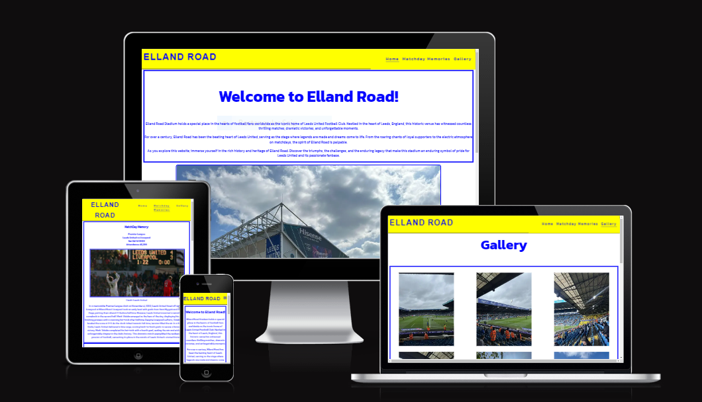

## Color schemes 

For the color scheme, I wanted to go with something that related to the color scheme of Elland Road itself. I selected the colors of blue, yellow and white. I used the following color grid created on https://contrast-grid.eightshapes.com/ to check the contrast scores. This grid allowed me to make sure the website was accessable to all.

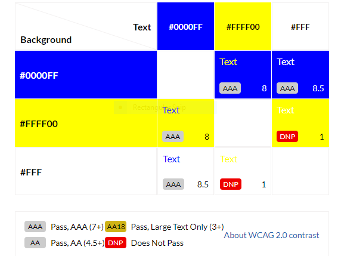

## Features

### Navigation
- Featured at the top of the page, The navigation shows the page name: Elland Road that links to top of the home page.

- The other navigation links are to the right: Home, Matchday Memories, Gallery, which links to different pages within the project.

- For mobile devices I added a menu icon which when clicked will open a dropdown menu of the navigation links to save space on mobile screens. 

- The navigation is in a google font with a background color of blue #0000FF that contrasts with the text color of yellow #FFFF00. 

-  The navigation tells the name of the website and makes the different sections of infomation easy to find.  

### The Header

- The header shows the name of the website and the navigation. 

- Is clear and easy to understand. 

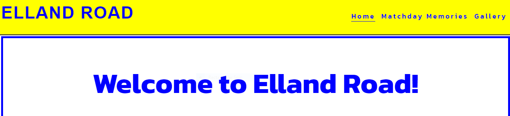

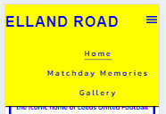

### The Footer
- The footer has a background color of blue #0000FF that contrast with icons and text in yellow #FFFF0.

- The social links uses clickable icons for each social media logo that links to each page in a seperate window. 

- contains copyright message along with credits to the website.

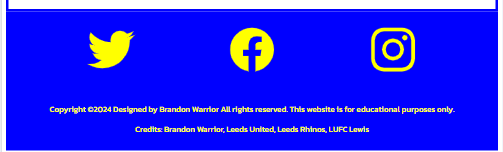

## Home Page 

- The home page gives a brief welcome message along with a photo of elland road and some additional facts below. 

- font color is easy to see and does not interfere with background color.

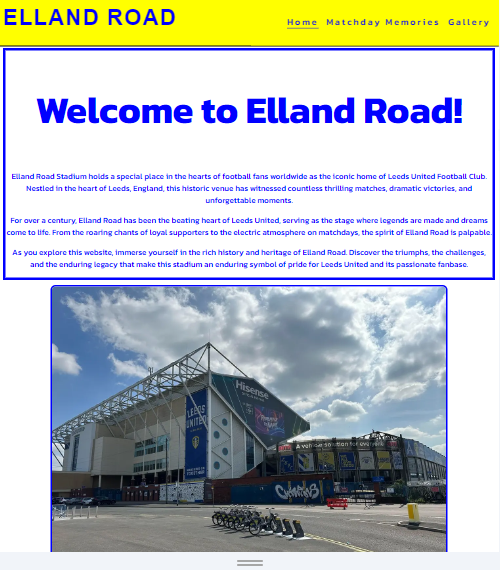
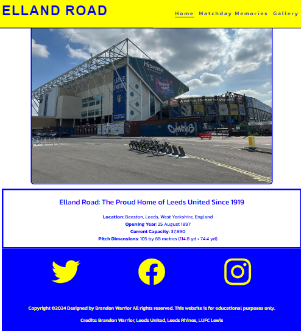

## Matchday Memories

- The Matchday Memories page gives the user infomation and historic facts about the sport events held at the venue over the years. 

- Includes the teams played, the date , competition and the attendance. 

- Uses images from the day of the events.

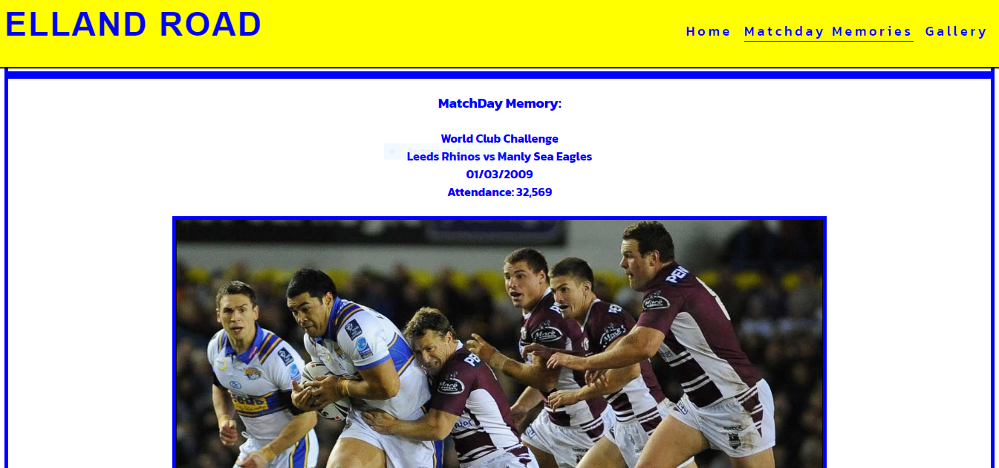
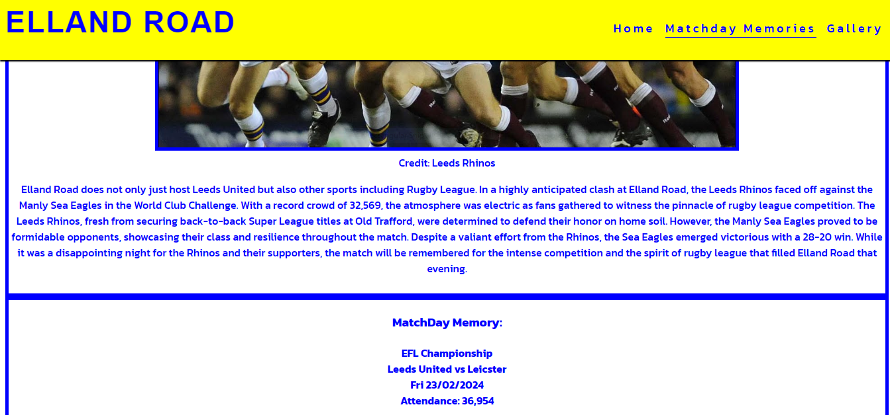

## The Gallery

 The Gallery page gives the user a visual tour of the what is inside and around the ground.
 As you can see i used a grid to display the gallery on desktop. On Tablets the grid maintains. However for mobile there is not grid and the images are in single file. 

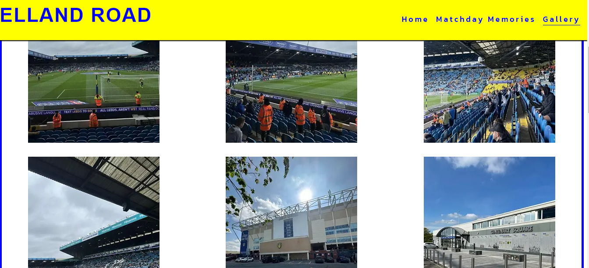

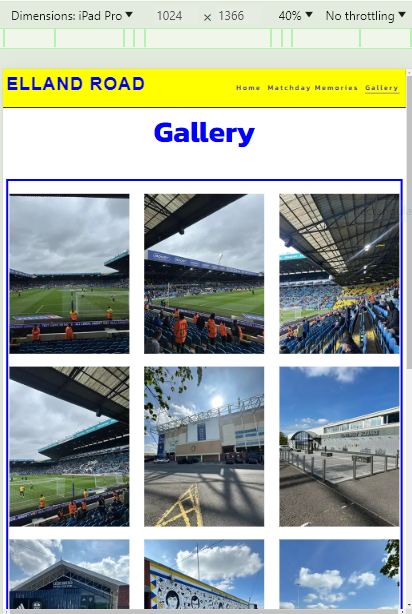

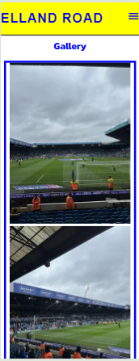

The gallery also has a video link to showcase the atmosphere at a sold out event.

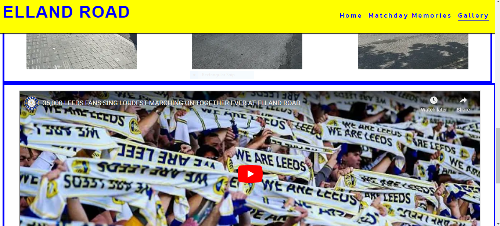

I applied a hover effect to the images on desktop, causing them to expand when hovered over and return to their original size when the cursor is moved away. 
Here is the code i used to do so and what the images look like:

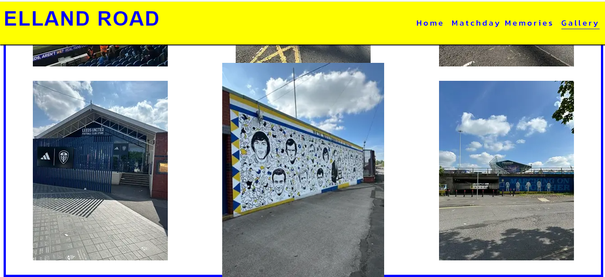

## Testing
- I have confirm that this page works on different browsers: Chrome, Firefox and Safari.

- I have confirm that all external links and navigation works on all browsers.

- i have confirm that the navigation and the content displayed on each page are readable and easy to understand. 

- I have confirm that the  video link works. 

## Validator

- No HTML errors were returned when passing through the W3C Validator.

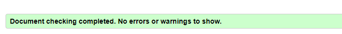

- No CSS errors were returned when passing through the offical (jigsaw) validator.

## Lighthouse

### Desktop lighthouse scores for each page:

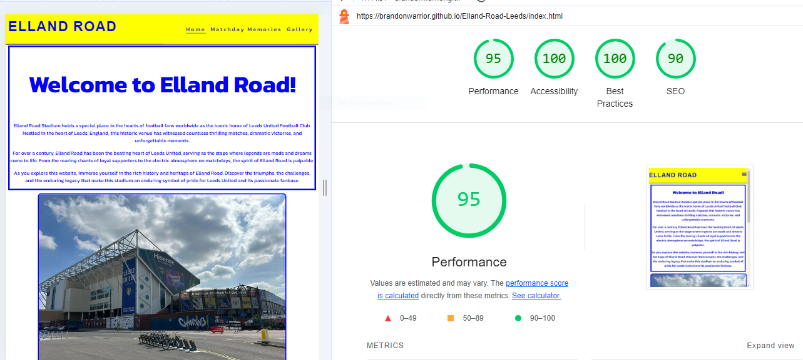
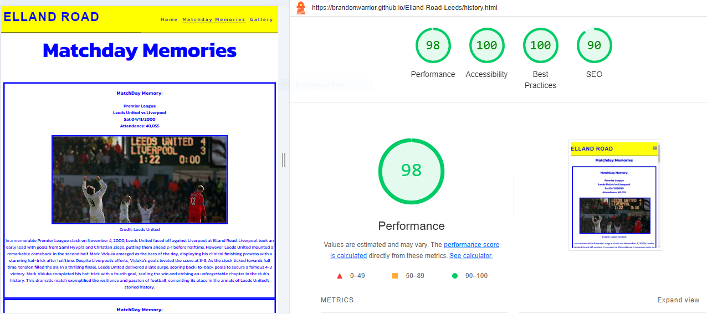
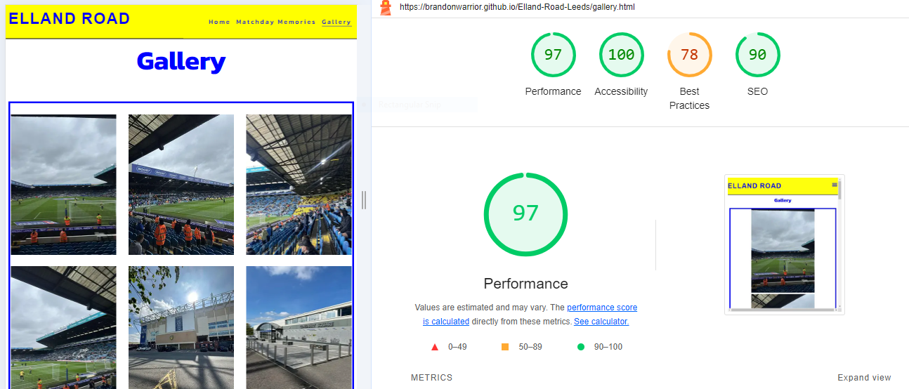

### Mobile lighthouse scores for each page:

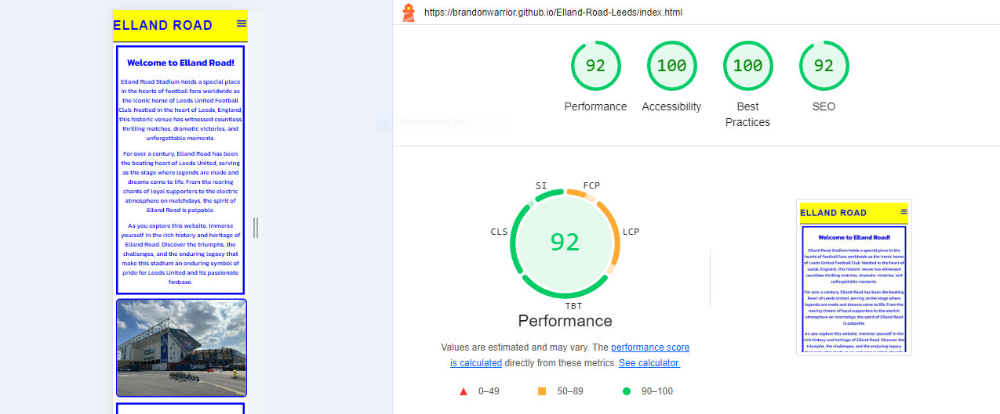
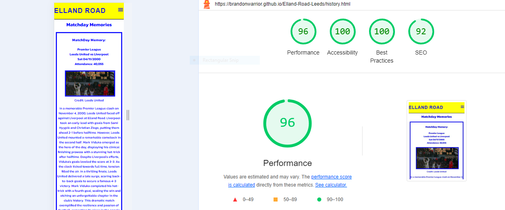
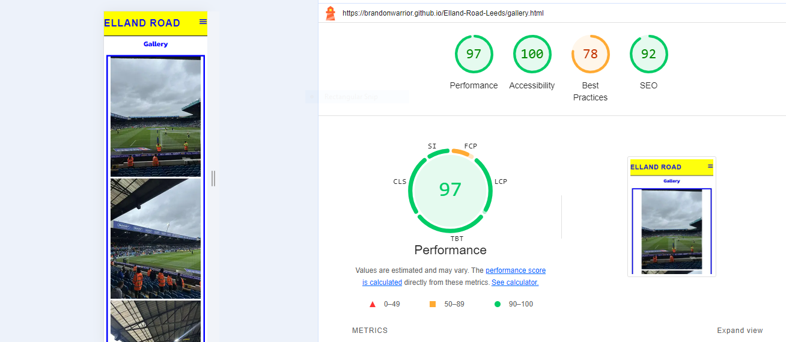

As you can see my scores did not change much apart from the gallery page. This is due to the Youtube video link.
However in incognito the best practices score is 100 suggesting that the cookies and Google API is impacting the score. As I have not touched on javascript yet this is something that is out of my control for now.   

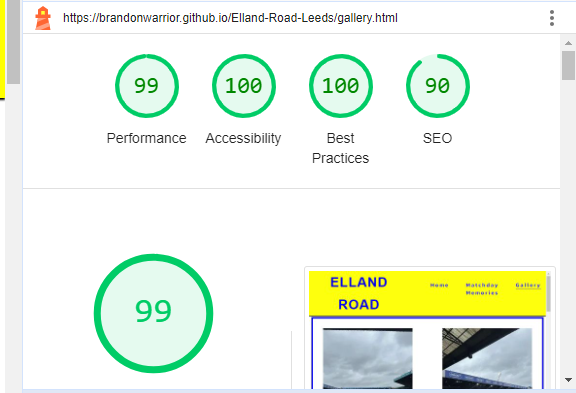

The mobile scores for my site were all green and similar in score.

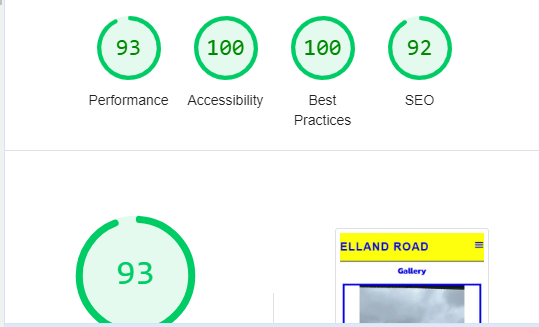

## Bugs and Fixes

### Bug 1
- An issue where the header was overlapping over the top of my main content on the page. 
### Fix 
- To ensure the content is properly positioned below the header, apply margin-top: 90px for mobile devices. For larger devices, increase the margin to 100px using media queries for screens with a minimum width of 768px and 992px:

### Bug 2 
- Color not applying to social icons. 
### Fix
- Discovered a typo to the social-icon class meant that the styles were not applying. Once corrected the social-icons colors were applied. 

### Bug 3 
- Menu icon not appearing on mobile devices.
### Fix
- Discovered not adding a closing label tag to the end of the opening label tag meant that the menu icon was not appearing. By adding the closing label tag meant that the menu icon was working on mobile devices.

### Bug 4 
- Poor Lighthouse performance scores.
### Fix
- Due to images being too big I resized them using https://redketchup.io/image-resizer and changed them from a JPEG file to a webp file. After this I then compressed the images using https://tinypng.com/. This boosted my lighthouse performance scores on Desktop and mobile devices.

## Deployment 
I deployed the page to GitHub Pages using the following steps:

1. Navigate to the project's repository and click on the Settings tab.
2. Select the Pages option from the menu on the left.
3. In the Source section, choose the Main branch from the drop-down menu and click Save.
4.  A confirmation message will appear, indicating a successful deployment to GitHub Pages and providing the live URL.

You can find the live site via the following URL: https://brandonwarrior.github.io/Elland-Road-Leeds
## Credits

#### Images Credit:
- The images from the home page and the gallery page are taken by myself Brandon Warrior.
- Matchday Memories images 1, 2, and 4 are creditted to LeedsUnited.com
- The 3rd image of Leeds Rhinos v Manly Sea Eagles is crediited to Leeds Rhinos youtube channel. 

#### Video Credit:
- Youtube: LUFC Lewis

### Header:
- The code to make the header and navigation is taken from the Love Running project.

