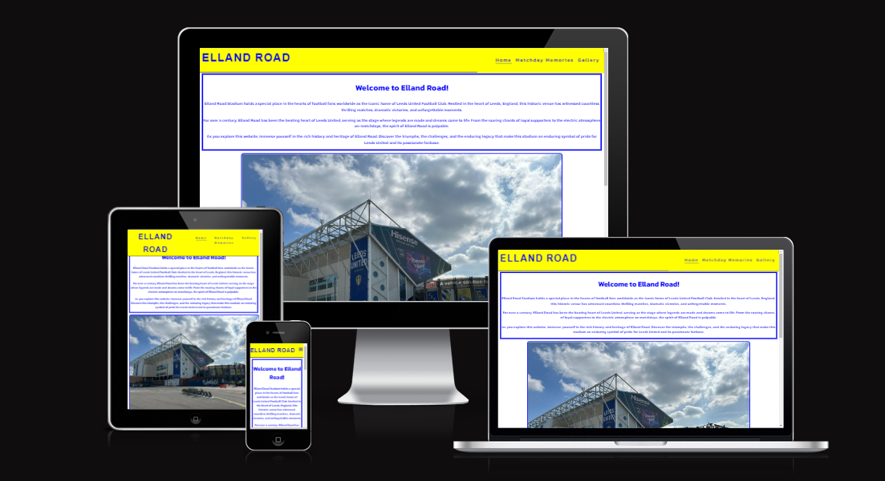
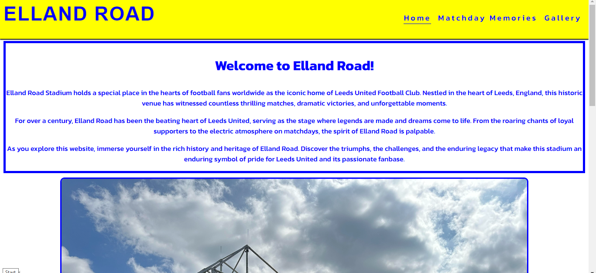
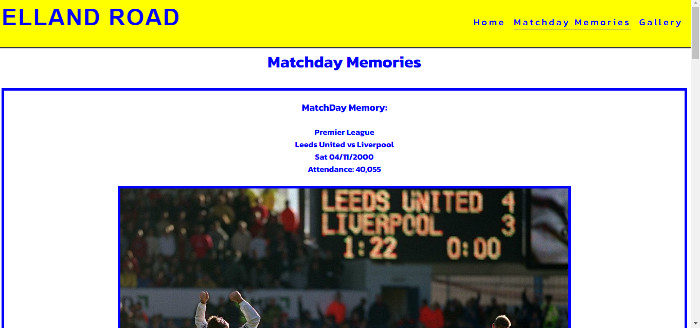
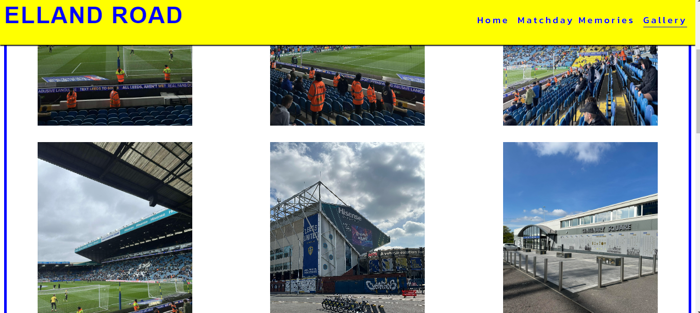
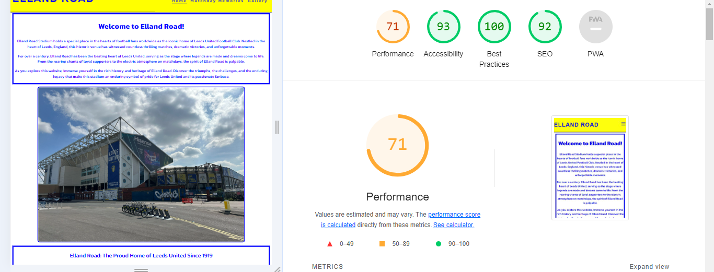

# Welcome To Elland Road

Welcome to the Elland Road history page project! This project is dedicated to providing a comprehensive history and information about Elland Road, the iconic football stadium located in Leeds, West Yorkshire, England. Home to Leeds United Football Club since the club's formation in 1919, Elland Road is steeped in rich history and tradition.

My goal is to create an informative and engaging resource for fans, historians, and anyone interested in learning more about this legendary stadium.

Explore the various sections of the page to uncover the matchday memories and a gallery showcasing the different loactions around the stadium

## Features

### Navigation
- Featured at the top of the page, The navigation shows the page name: Elland Road that links to top of the home page.

- The other navigation links are to the right: Home, Matchday Memories, Gallery, which links to different pages within the project.

- The navigation is in a google font with a background color of blue #0000FF that contrasts with the text color of yellow #FFFF00. 

-  The navigation tells the name of the website and makes the different sections of infomation easy to find.  

### The Header

- The header shows the name of the website and te navigation. 

### The Footer
- The footer has a background color of blue #0000FF that contrast with icons and text in yellow #FFFF0.

- The social links uses clickable icons for each social media logo that links to each page in a seperate window. 

## Matchday Memories

- The Matchday Memories page gives the user infomation and historic facts about the sport events held at the venue over the years. 

- Uses images from the day of the events.

## The Gallery

- The Gallery page gives the user a visual tour of the what is inside and around the ground.

- Has a video link to showcase the atmosphere at a sold out event.

## Validator

- No HTML errors were returned when passing through the W3C Validator.

- No CSS errors were returned when passing through the offical (jigsaw) validator.

## Unfixed Bugs
- No unfixed bugs 

## Deployment and Testing
- I have tested that this page works on different browsers: Chrome, Firefox and Safari.

- I have tested that all external links and navigation works on all browsers.
## Credits

### Media

#### Images Credit:
- LeedsUnited.com
- LeedsRhinos.com

#### Video Credit:
- Youtube: LUFC Lewis

### Header:
- Code for header and navigation from the Love Running project.

