# Welcome To Elland Road

Welcome to the Elland Road history page project! This project is dedicated to providing a comprehensive history and information about Elland Road, the iconic football stadium located in Leeds, West Yorkshire, England. Home to Leeds United Football Club since the club's formation in 1919, Elland Road is steeped in rich history and tradition.

My goal is to create an informative and engaging resource for fans, historians, and anyone interested in learning more about this legendary stadium.

Explore the various sections of the page to uncover the matchday memories and a gallery showcasing the different loactions around the stadium. 

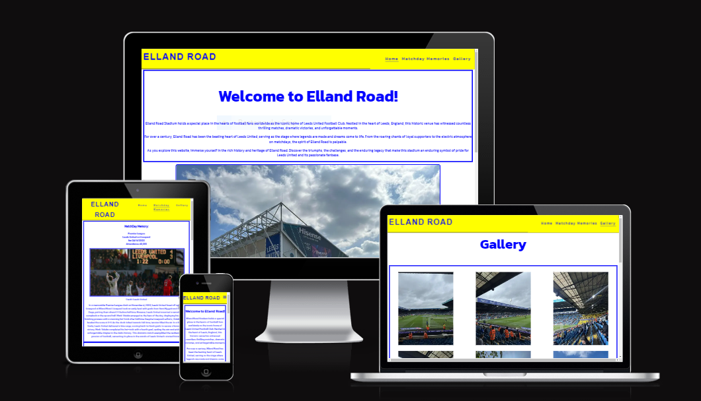

## Color schemes 

For the color scheme, I wanted to go with something that related to the color scheme of Elland Road itself. I selected the colors of blue, yellow and white. I used the following color grid created on https://contrast-grid.eightshapes.com/ to check the contrast scores. This grid allowed me to make sure the website was accessable to all.

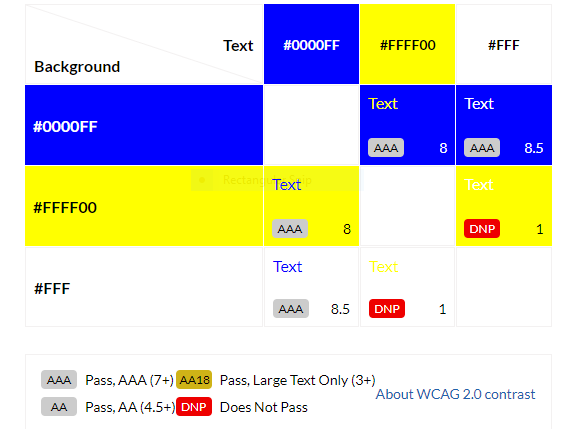

## Features

### Navigation
- Featured at the top of the page, The navigation shows the page name: Elland Road that links to top of the home page.

- The other navigation links are to the right: Home, Matchday Memories, Gallery, which links to different pages within the project.

- The navigation is in a google font with a background color of blue #0000FF that contrasts with the text color of yellow #FFFF00. 

-  The navigation tells the name of the website and makes the different sections of infomation easy to find.  

### The Header

- The header shows the name of the website and te navigation. 

- Is clear and easy to understand. 

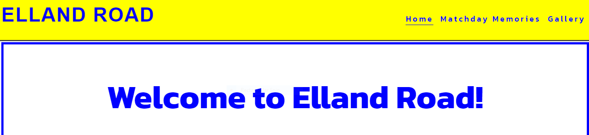

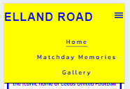

### The Footer
- The footer has a background color of blue #0000FF that contrast with icons and text in yellow #FFFF0.

- The social links uses clickable icons for each social media logo that links to each page in a seperate window. 

- contains a copyright message along with credits to the website.

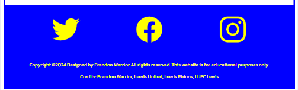

## Home Page 

- The home page gives a brief welcome message along with a photo of elland road and some additional facts below. 

- font color is easy to see and does not interfere with background color.

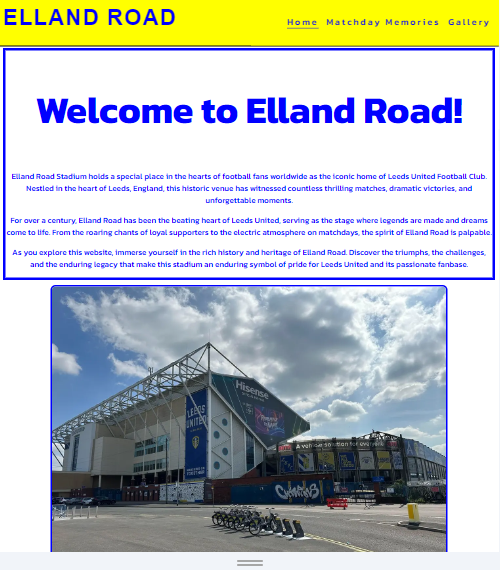
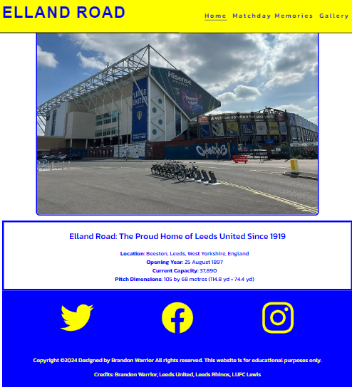

## Matchday Memories

- The Matchday Memories page gives the user infomation and historic facts about the sport events held at the venue over the years. 

- Uses images from the day of the events.

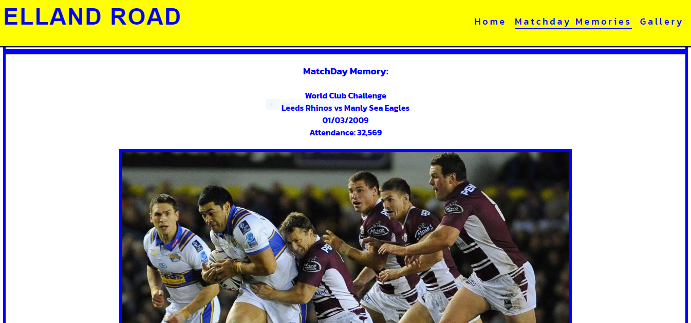
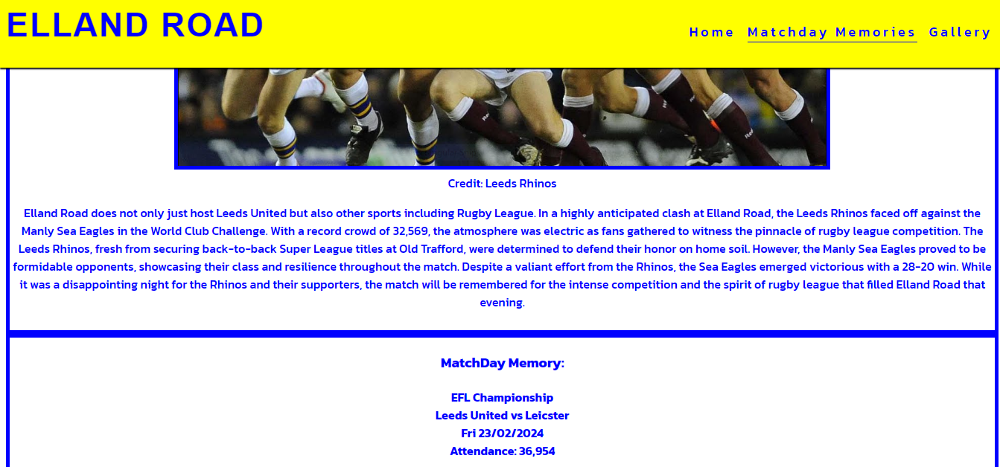

## The Gallery

- The Gallery page gives the user a visual tour of the what is inside and around the ground.

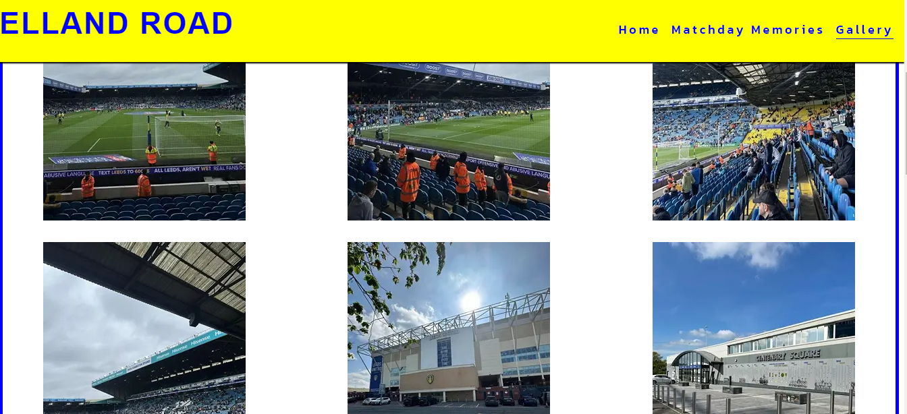

- Has a video link to showcase the atmosphere at a sold out event.

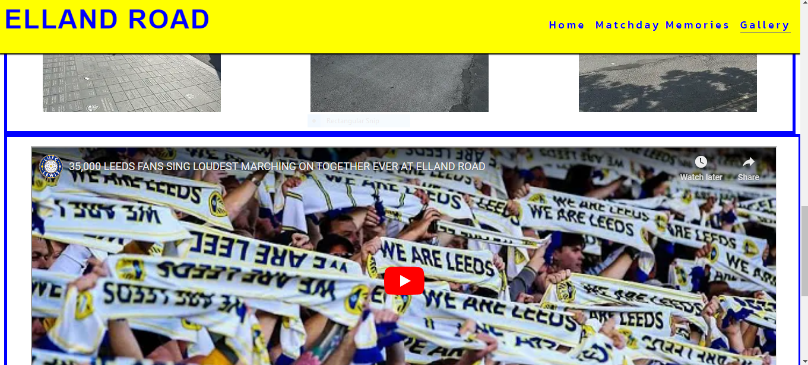

## Validator

- No HTML errors were returned when passing through the W3C Validator.

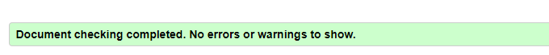

- No CSS errors were returned when passing through the offical (jigsaw) validator.

### Testing
- I have tested that this page works on different browsers: Chrome, Firefox and Safari.

- I have tested that all external links and navigation works on all browsers.

## Lighthouse

### Desktop lighthouse scores for each page:

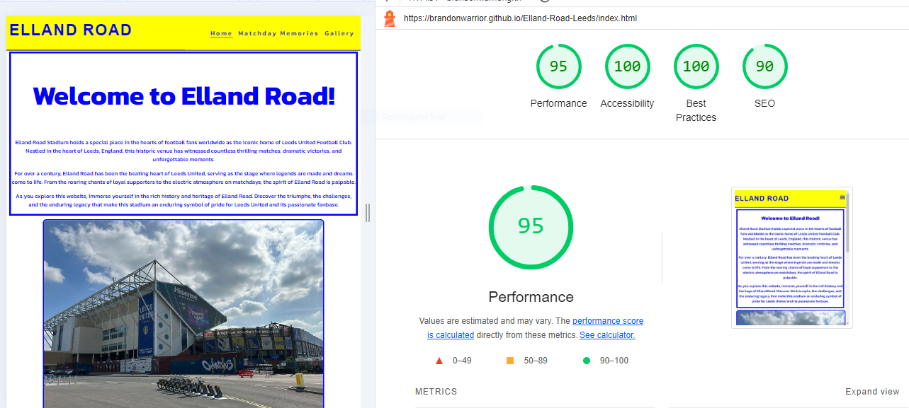
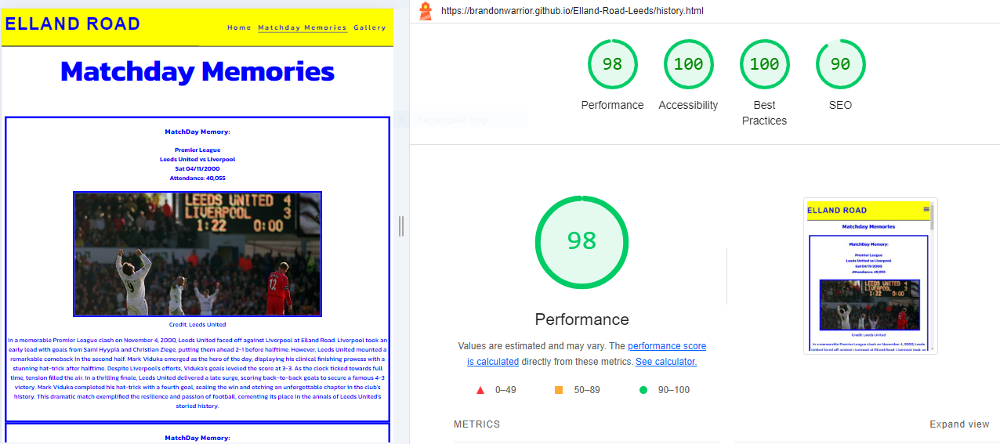
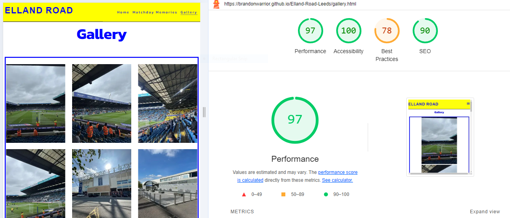

### Mobile lighthouse scores for each page:

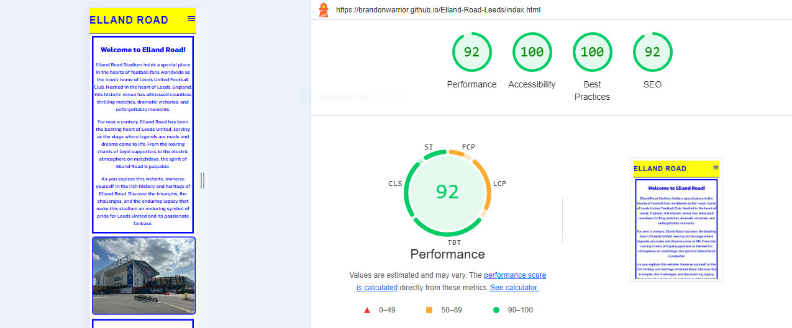
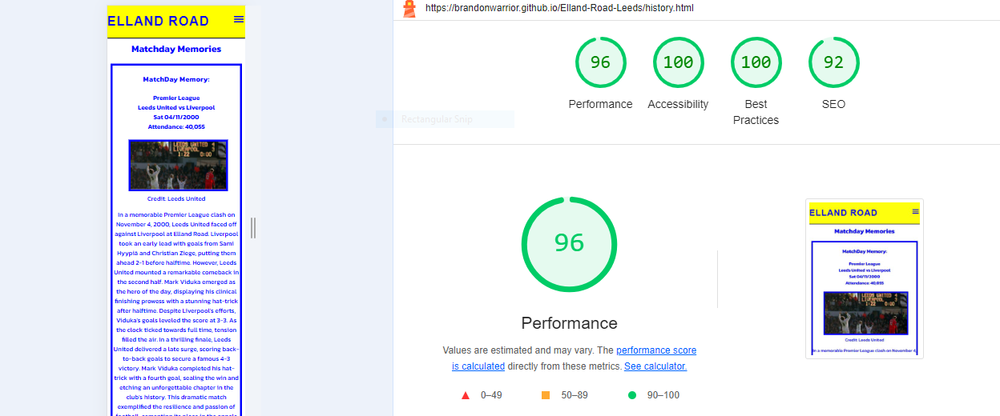
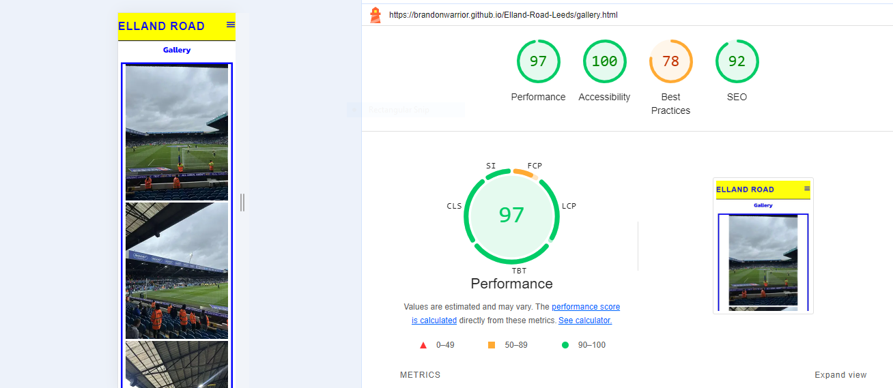

- As you can see my scores did not change much apart from the gallery page. This is due to the Youtube video link.

- However in incognito the best practices score is 100 suggesting that the cookies and google fonts is impacting the score. 

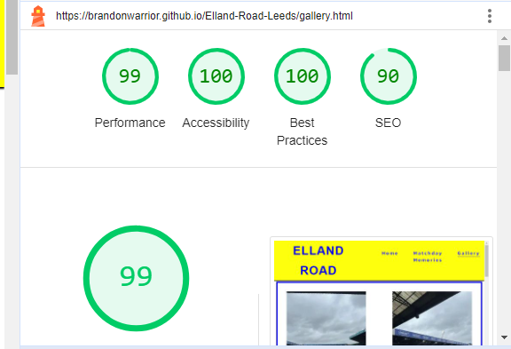

- The mobile scores for my site were all green and similar score.

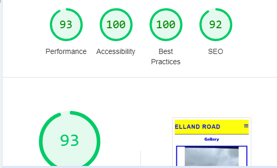

## Bugs and Fixes

### Bug 1
- An issue where the header was overlapping over the top of my main content on the page. 
### Fix 
- To ensure the content is properly positioned below the header, apply margin-top: 90px for mobile devices. For larger devices, increase the margin to 100px using media queries for screens with a minimum width of 768px and 992px:

### Bug 2 
- Color not applying to social icons. 
### Fix
Discovering a typo to the social-icon class meant that the styles were not applying. Once corrected the social-icons colors were applied. 

### Bug 3 
- Menu icon not appearing on mobile devices.
### Fix
- Discovering not adding a </label> tag to the end of the <label> meant that the menu icon was not appearing. By adding the </label> tag meant that the menu icon was working on mobile devices.

### Bug 4 
Poor Lighthouse performance scores.
### Fix
Due to images being too big I resized them using https://redketchup.io/image-resizer and changed them from a JPEG file to a webp file. After this i then compressed the images using https://tinypng.com/. This boosted my lighthouse scores on Desktop and mobile devices.

## Testing
- I have confirmed that this page works on different browsers: Chrome, Firefox and Safari.

- I have confirmed that all external links and navigation works on all browsers.

- i have confirmed that the navigation and the content displayed on each page are readable and easy to understand. 

## Deployment 
I deployed the page to GitHub Pages using the following steps:

- Navigate to the project's repository and click on the Settings tab.
- Select the Pages option from the menu on the left.
- In the Source section, choose the Main branch from the drop-down menu and click Save.
- A confirmation message will appear, indicating a successful deployment to GitHub Pages and providing the live URL.

- You can find the live site via the following URL - https://brandonwarrior.github.io/Elland-Road-Leeds/
## Credits

#### Images Credit:
- The images from the home page and the gallery page are taken by myself Brandon Warrior.
- LeedsUnited.com
- Youtube: Leeds Rhinos

#### Video Credit:
- Youtube: LUFC Lewis

### Header:
- The code to make the header and navigation is from the Love Running project.

